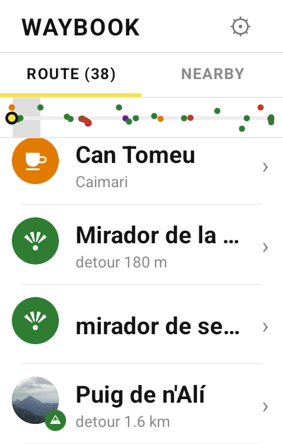
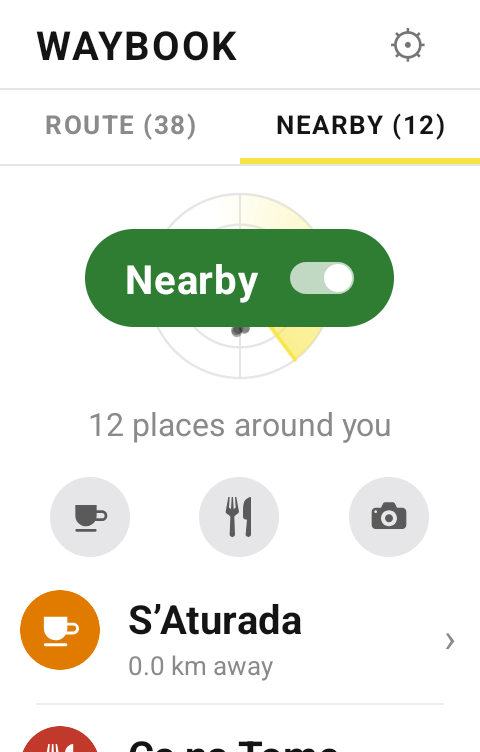
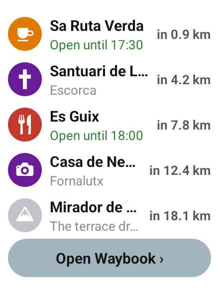
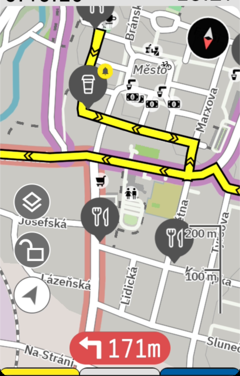
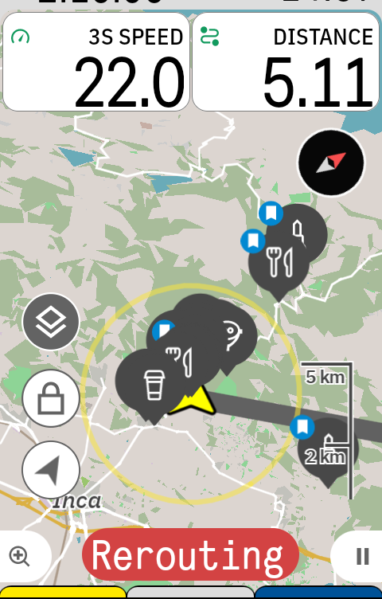

# Waybook for Karoo — releases

Public download and auto-update channel for **Waybook**, an extension for the
[Hammerhead Karoo](https://www.hammerhead.io/) that turns any loaded route into an
illustrated, offline guide to the places along your ride.

Load a route, tap Build, and the cafés, climbs, villages and sights along it come with you,
along with the reason riders know them. Photos, opening hours, and how far ahead each one
stands. Once it is built it needs no signal.

- **Website:** https://waybook.cc/karoo
- **This repo holds only the packaged Karoo app (APK) releases** — not the source; see
  [LICENSE](./LICENSE).

|  |  |  |  |
|:--:|:--:|:--:|:--:|
|  |  |  |  |
| **The route, in order**, with photos, opening hours and the distance ahead. | **Tap one for the card**: what it is, why riders know it, and where the words came from. | **Nearby**, for when the plan changes — filtered to coffee, food or something to look at. | **On the ride screen**, so you never open the app. |

Every place is also a pin on the map you already navigate with, and *Navigate here* hands it
to turn-by-turn with the detour it will cost you.

|  |  |
|:--:|:--:|
|  |  |
| **On the route**, next to the line you are following. | **Nearby**, drawn around you as you ride. |

## Install

Waybook is sideloaded (it is not in Hammerhead's app store).

1. On the Karoo, allow installing apps from unknown sources (the installer prompts you the
   first time).
2. Download the latest `waybook-<n>.apk` from the
   **[Releases page](https://github.com/jakubfoglar/waybook-karoo/releases/latest)** — the
   easiest path is to open that page in the Karoo's browser and download directly to the
   device; you can also transfer the APK over USB.
3. Tap the APK to install.
4. Open **Waybook** from the app list, then add the **Waybook** data field to a ride screen
   (long-press a field → pick Waybook).

That is the only sideload. After the first install, updates are one tap: open Waybook →
**Check for update** (needs WiFi). The app installs the newest release from this repo
itself — no cable, no laptop.

## Beta

Waybook is in beta. During the beta the app sends anonymous diagnostics, position included,
so that real rides find the bugs. A switch in Settings turns that off, and
[waybook.cc/privacy](https://waybook.cc/privacy) says what gets sent.

## Licensing & attribution

Waybook is © 2026 Jakub Foglar, all rights reserved, and is **not** open source; the terms
of use are in the [Waybook License](./LICENSE). Place data is assembled from OpenStreetMap,
Wikipedia / Wikivoyage / Wikidata and Wikimedia Commons under their own licenses; full
attribution is in [NOTICE.md](./NOTICE.md).

An independent extension — **not affiliated with Hammerhead or SRAM**. "Karoo" is a
trademark of its owner.
